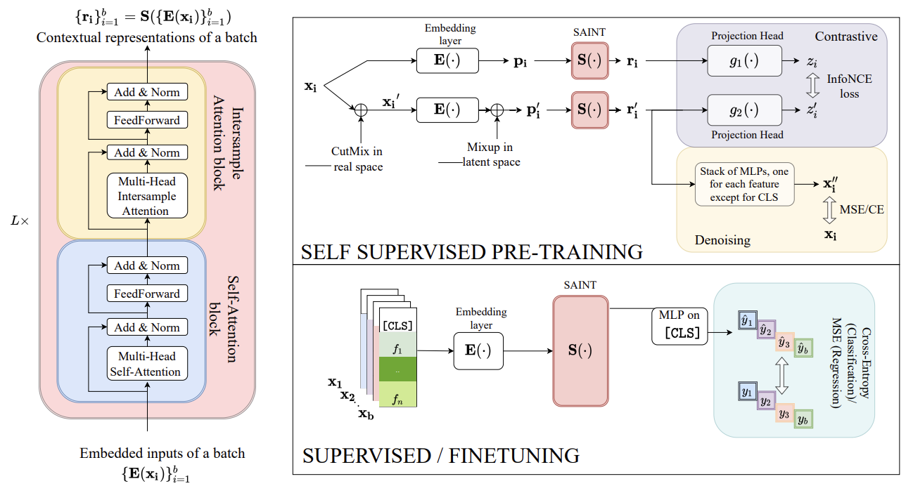
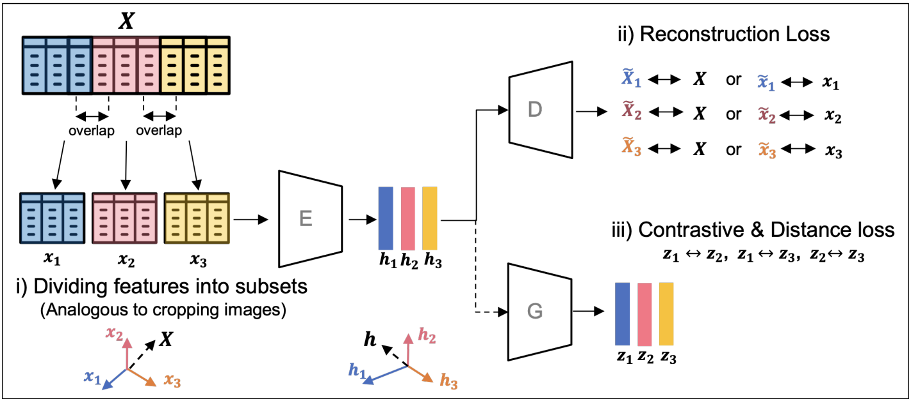
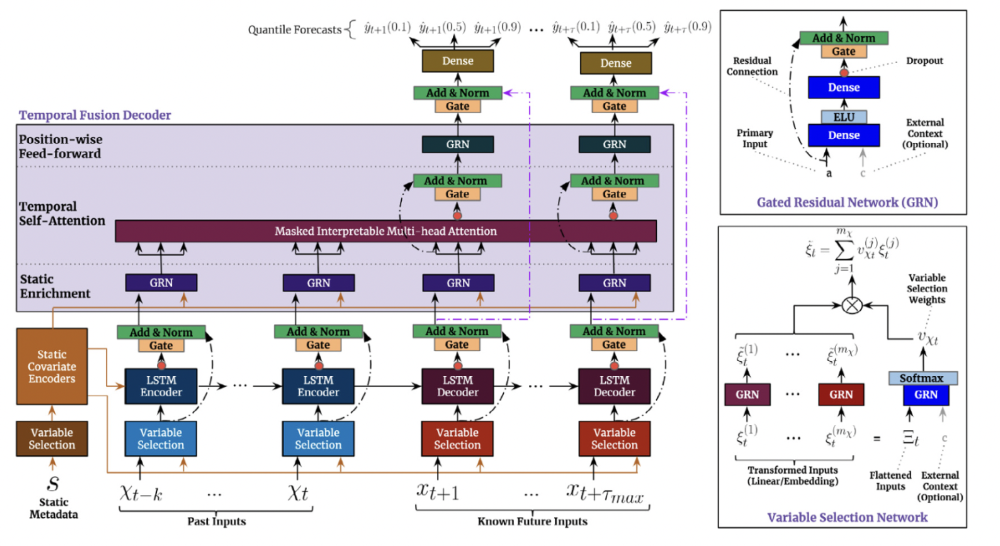

# structured-transformers
TensorFlow implementation of Transformers models for structured data, with a particular focus on time series and tabular data.

## Transformers for Tabular Data

* **S**elf-**A**ttention and **In**tersample Attention **T**ransformer from [SAINT: Improved Neural Networks for Tabular Data via Row Attention and Contrastive Pre-Training](https://arxiv.org/pdf/2106.01342.pdf).

* **Sub**setting Features of **Tab**ular Data from [SubTab: Subsetting Features of Tabular Data for Self-Supervised Representation Learning](https://arxiv.org/pdf/2110.04361.pdf).

## Transformers for Time Series
* **T**emporal **F**usion **T**ransformers from [Temporal Fusion Transformers for interpretable multi-horizon time series forecasting](https://www.sciencedirect.com/science/article/pii/S0169207021000637).

## Non-Parametric Transformers
* **N**on-**P**arametric **T**ransformers from [Self-Attention Between Datapoints: Going Beyond Individual Input-Output Pairs in Deep Learning](https://arxiv.org/pdf/2106.02584.pdf).

## License
[MIT License](LICENSE)
